# Image Processing
assignments from Pendidikan Ganesha University's, Pengolahan Citra Digital (PCD) course

| |  |
| ----------- | ----------- |
| Nama      | Maulana Kurnia Fiqih Ainul Yaqin       |
| NPM UPN   | 123180176        |
| NPM Undiksha   | 2110410274        |

All source code and images below can be seen at the following link : https://github.com/maulanakurnia/image-processing

## System Requirements
- Python3
- Python pip

## Python Package
- PySimpleGUI
- PILLOW

## overview application
## Blank 
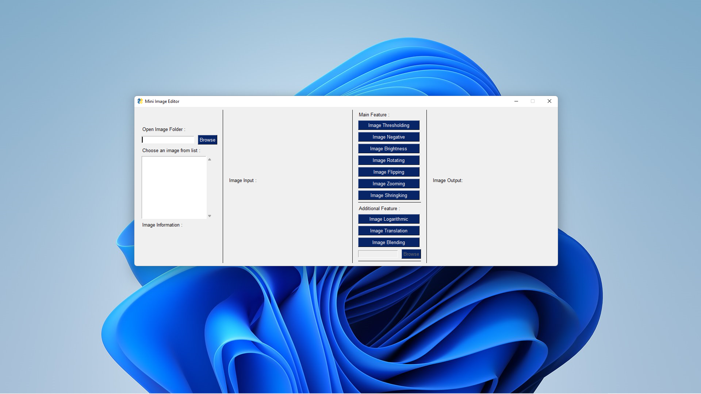

## Image Thresholding
To create a binary image, we use a grayscale image. Here's the program:
```python
def thresholding(input_image, coldepth, val):
    if coldepth != 25:
        input_image = input_image.convert('RGB')
        T = val
        output_image = Image.new(
            'RGB', (input_image.size[0], input_image.size[1]))
        pixels = output_image.load()

    for i in range(output_image.size[0]):
        for j in range(output_image.size[1]):
            r, g, b = input_image.getpixel((i, j))
            if r and g and b < T:
                pixels[i, j] = (0, 0, 0)
            else:
                pixels[i, j] = (255, 255, 255)

    if coldepth == 1:
        output_image = output_image.convert("1")
    elif coldepth == 8:
        output_image = output_image.convert("L")
    else:
        output_image = output_image.convert("RGB")

    return output_image
```
result with a threshold of 50:
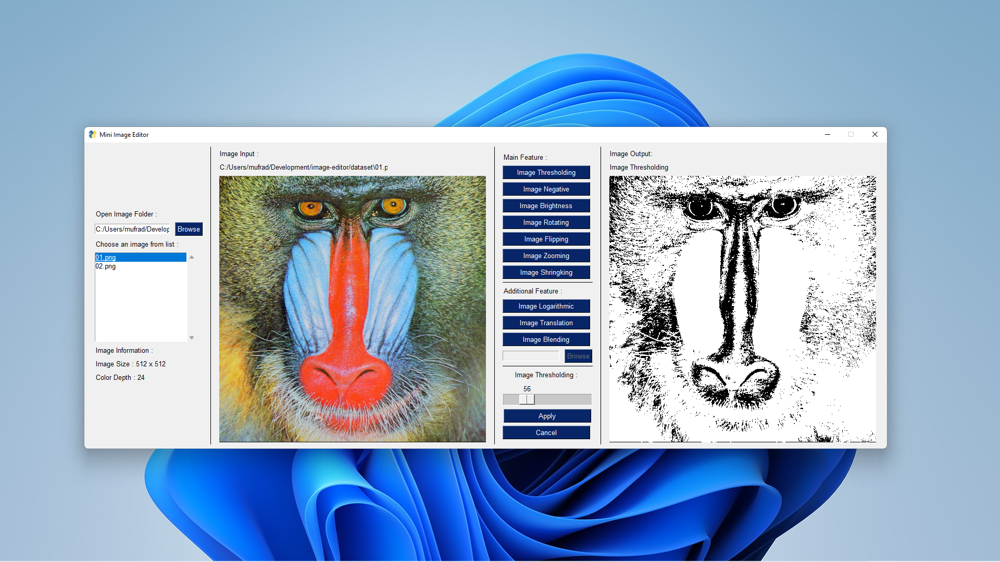
## Image Negative
To create a negative image, here's the program:
```python
def negative(input_image, color_depth):
    if color_depth != 24:
        input_image = input_image.convert("RGB")
    input_pixels = input_image.load()
    output_image = Image.new("RGB", input_image.size)
    output_pixels = output_image.load()

    horizontal_size = output_image.size[0]
    vertical_size = output_image.size[1]

    for x in range(horizontal_size):
        for y in range(vertical_size):
            R = 255 - input_pixels[x, y][0]
            G = 255 - input_pixels[x, y][1]
            B = 255 - input_pixels[x, y][2]
            output_pixels[x, y] = (R, G, B)

    if color_depth == 1:
        output_image = output_image.convert("1")
    elif color_depth == 8:
        output_image = output_image.convert("L")
    else:
        output_image = output_image.convert("RGB")

    return output_image
```
result processing:
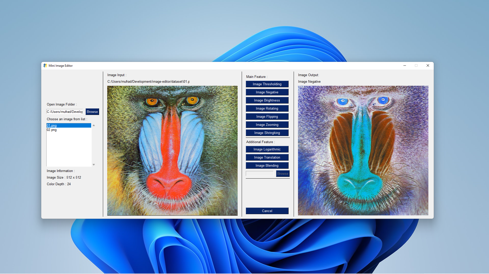
## Image Brigtness
for the image brightening operation, the following is the program:
```python
def clipping(intensity):
    if intensity < 0:
        return 0
    if intensity > 255:
        return 255
    return intensity


def brightness(input_image, color_depth, enlightenment_value):
    if color_depth != 25:
        input_image = input_image.convert("RGB")
    input_pixels = input_image.load()

    output_image = Image.new("RGB", input_image.size)
    output_pixels = output_image.load()

    horizontal_size = output_image.size[0]
    vertical_size = output_image.size[1]

    for x in range(horizontal_size):
        for y in range(vertical_size):
            R = clipping(input_pixels[x, y][0] + enlightenment_value)
            G = clipping(input_pixels[x, y][1] + enlightenment_value)
            B = clipping(input_pixels[x, y][2] + enlightenment_value)
            output_pixels[x, y] = (R, G, B)

    if color_depth == 1:
        output_image = output_image.convert("1")
    elif color_depth == 8:
        output_image = output_image.convert("L")
    else:
        output_image = output_image.convert("RGB")

    return output_image
```
result processing : 
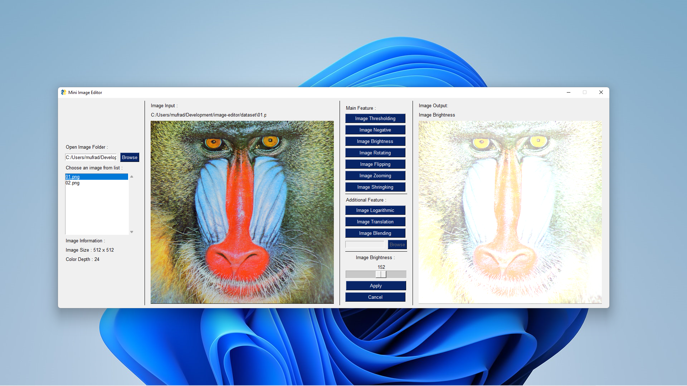
## Image Rotation
Here's an image rotation implementation in python:
```python
def rotating(input_image, color_depth, deg):
    if color_depth != 25:
        input_image = input_image.convert("RGB")
        input_pixels = input_image.load()

    horizontal_size = input_image.size[0]
    vertical_size = input_image.size[1]

    output_image = Image.new("RGB", input_image.size)
    output_pixels = output_image.load()

    x0 = horizontal_size//2
    y0 = vertical_size//2

    for x1 in range(horizontal_size):
        for y1 in range(vertical_size):
            radian = deg * 22/7 / 180

            # rotation formula with center of free rotation
            # source : https://homepages.inf.ed.ac.uk/rbf/HIPR2/rotate.htm
            x2 = int((x1-x0)*cos(radian) - (y1-y0)*sin(radian)+x0)
            y2 = int((x1-x0)*sin(radian) + (y1-y0)*cos(radian)+y0)
            if (x2 >= horizontal_size or y2 >= vertical_size or x2 < 0 or y2 < 0):
                output_pixels[x1, y1] = (0, 0, 0)
            else:
                output_pixels[x1, y1] = input_pixels[x2, y2]

    if color_depth == 1:
        output_image = output_image.convert("1")
    elif color_depth == 8:
        output_image = output_image.convert("L")
    else:
        output_image = output_image.convert("RGB")

    return output_image
```
result image rotating with 132 degree :
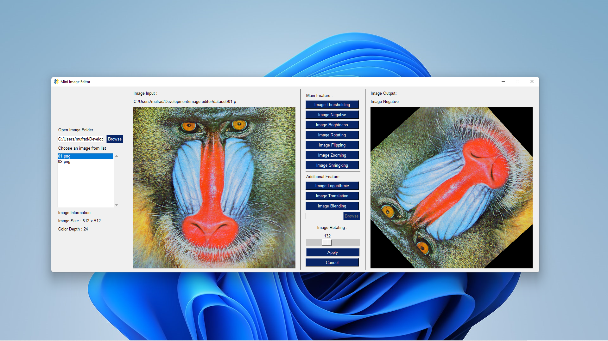
## Image Flipping
Here's an image flipping implementation in python:
```python
def flipping(input_image, color_depth, type):
    input_image = input_image
    input_pixels = input_image.load()

    if color_depth != 25:
        input_image = input_image.convert("RGB")

    horizontal_size = input_image.size[0]
    vertical_size = input_image.size[1]

    output_image = Image.new("RGB", input_image.size)
    output_pixels = output_image.load()

    for x in range(horizontal_size):
        for y in range(vertical_size):
            if type == "vertical":
                output_pixels[x, y] = input_pixels[x, vertical_size-1-y]
            elif type == "horizontal":
                output_pixels[x, y] = input_pixels[horizontal_size-1-x, y]
            else:
                output_pixels[x, y] = input_pixels[horizontal_size -
                                                   1-x, vertical_size-1-y]
    if color_depth == 1:
        output_image = output_image.convert("1")
    elif color_depth == 8:
        output_image = output_image.convert("L")
    else:
        output_image = output_image.convert("RGB")

    return output_image
```
result image flipping horizontal :
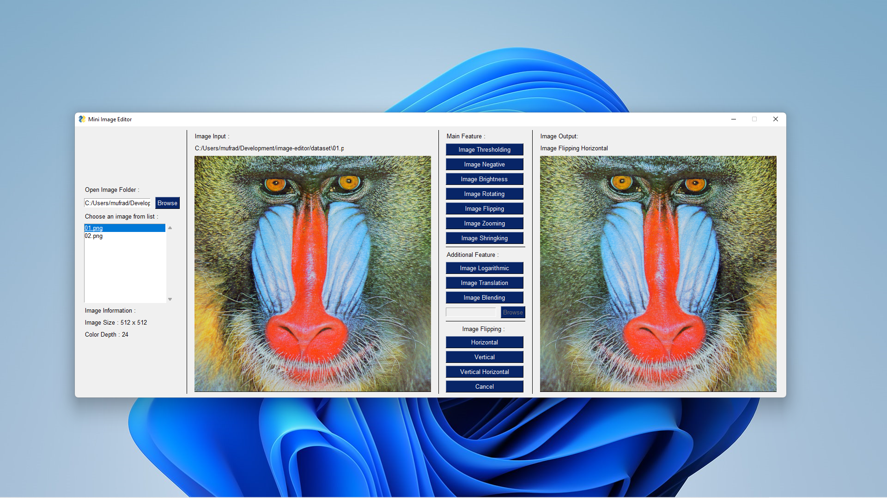
## Image Zooming
The following is an image zooming implementation : 
```python
def zooming(input_image, color_depth, scale):
    if color_depth != 24:
        input_image = input_image.convert("RGB")

    output_image = Image.new(
        "RGB", (input_image.size[0]*scale, input_image.size[1]*scale))
    output_pixels = output_image.load()

    horizontal_size = output_image.size[0]
    vertical_size = output_image.size[1]

    for x in range(horizontal_size):
        for y in range(vertical_size):
            r, g, b = input_image.getpixel((x/scale, y/scale))
            output_pixels[x, y] = (r, g, b)

    if color_depth == 1:
        output_image = output_image.convert("1")
    elif color_depth == 8:
        output_image = output_image.convert("L")
    else:
        output_image = output_image.convert("RGB")

    return output_image
```
result image processing:
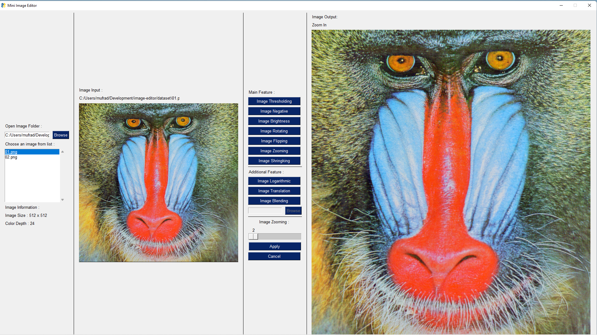
## Image Shrinking
The following is an image shringking implementation
```python
def shringking(input_image, color_depth, scale):
    if color_depth != 24:
        input_image = input_image.convert("RGB")

    output_image = Image.new(
        "RGB", (int(input_image.size[0]/scale), int(input_image.size[1]/scale)))
    output_pixels = output_image.load()

    horizontal_size = output_image.size[0]
    vertical_size = output_image.size[1]

    for x in range(horizontal_size):
        for y in range(vertical_size):
            r, g, b = input_image.getpixel((x*scale, y*scale))
            output_pixels[x, y] = (r, g, b)

    if color_depth == 1:
        output_image = output_image.convert("1")
    elif color_depth == 8:
        output_image = output_image.convert("L")
    else:
        output_image = output_image.convert("RGB")

    return output_image
```
result image processing :
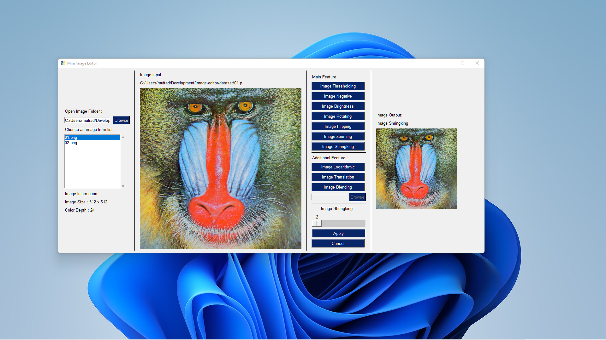

## Image Blending
The following is an image blending implementation : 
```python
def blending(input_image_1, input_image_2, coldepth):
    if coldepth != 25:
        input_image_1 = input_image_1.convert('RGB')
        input_pixels_1 = input_image_1.load()

        input_image_2 = input_image_2.convert('RGB')
        input_pixels_2 = input_image_2.load()

        output_image = Image.new(
            "RGB", (input_image_1.size[0], input_image_1.size[1]))
        output_pixels = output_image.load()

    for x in range(input_image_1.size[0]):
        for y in range(input_image_1.size[1]):
            r = input_pixels_1[x, y][0] - input_pixels_2[x, y][0]
            g = input_pixels_1[x, y][1] - input_pixels_2[x, y][1]
            b = input_pixels_1[x, y][2] - input_pixels_2[x, y][2]
            output_pixels[x, y] = (r, g, b)

            # jika terdapat perbedaan antara pixel 1 & pixel 2,
            # gunakan pixel 2
            if(r > 0 or g > 0 or b > 0):
                output_pixels[x, y] = input_pixels_2[x, y]

    if coldepth == 1:
        output_image = output_image.convert("1")
    elif coldepth == 8:
        output_image = output_image.convert("L")
    else:
        output_image = output_image.convert("RGB")

    return output_image
```
result image processing : 
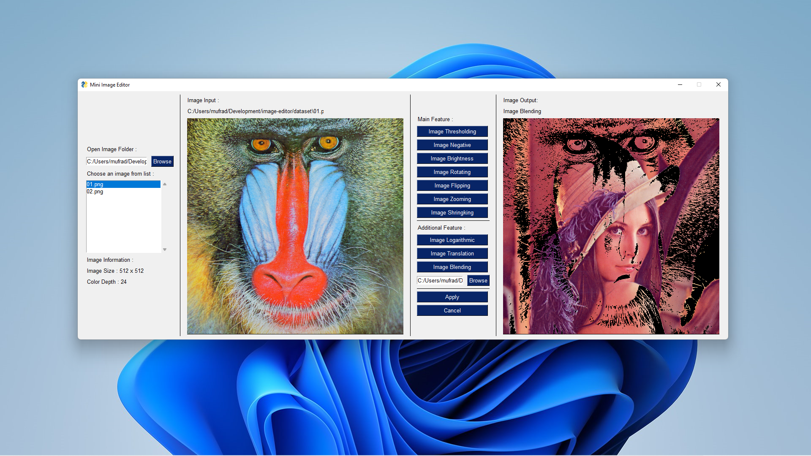
## Image Logarithmic
untuk membuat citra biner, kita menggunakan citra grayscale. Berikut programnya:
```python
def logarithmic(input_image, coldepth):
    if coldepth != 25:
        input_image = input_image.convert('RGB')
        C = 40
        output_image = Image.new(
            'RGB', (input_image.size[0], input_image.size[1]))
        pixels = output_image.load()
    for i in range(output_image.size[0]):
        for j in range(output_image.size[1]):
            r, g, b = input_image.getpixel((i, j))
            pixels[i, j] = (int(C*log(1+r)),
                            int(C*log(1+g)),
                            int(C*log(1+b)))
    if coldepth == 1:
        output_image = output_image.convert("1")
    elif coldepth == 8:
        output_image = output_image.convert("L")
    else:
        output_image = output_image.convert("RGB")

    return output_image
```
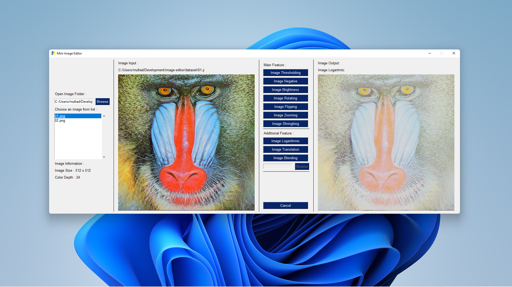
## Image Translation
The following is an image translation implementation
```python
def translation(input_image, coldepth, shift):
    if coldepth != 25:
        input_image = input_image.convert("RGB")
        input_pixels = input_image.load()

        output_image = Image.new(
            'RGB', (input_image.size[1], input_image.size[0]))
        output_pixels = output_image.load()

    start_m = shift[0]
    start_n = shift[1]

    if shift[0] < 0:
        start_m = 0
    if shift[1] < 0:
        start_n = 0

    for x in range(start_m, input_image.size[0]):
        for y in range(start_n, input_image.size[1]):
            new_x = x - shift[0]
            new_y = y - shift[1]

            if(new_x >= input_image.size[0] or new_y >= input_image.size[1] or new_x < 0 or new_y < 0):
                output_pixels[x, y] = (0, 0, 0)
            else:
                output_pixels[x, y] = input_pixels[new_x, new_y]

    if coldepth == 1:
        output_image = output_image.convert("1")
    elif coldepth == 8:
        output_image = output_image.convert("L")
    else:
        output_image = output_image.convert("RGB")

    return output_image
```
result image translation with x = 100 & y = 200
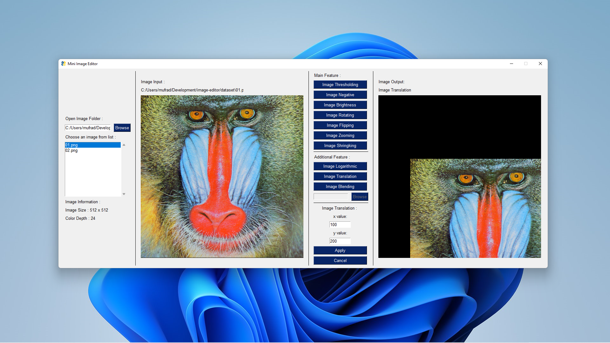
